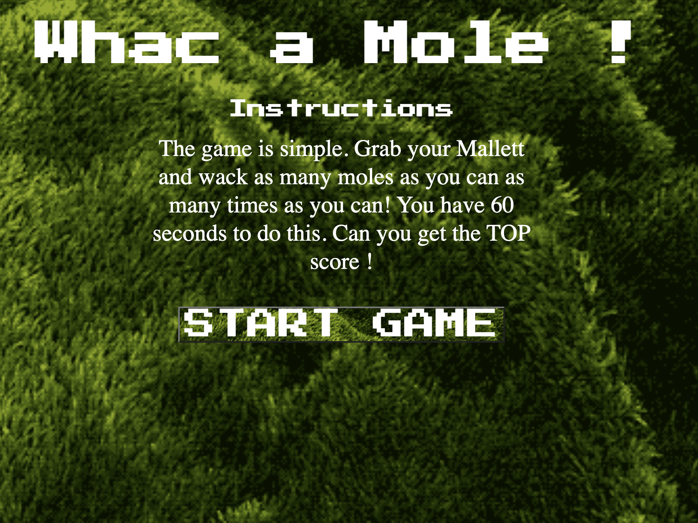

# WhacAMole
This is a fun and exciting game where the objectives is to wack as many moles as possible as many times as possible to score the most points. The first level is a 3x3 grid where moles appear in random boxes for a random amount of time. This will keep you on your toes and keep the game interesting because there is no consistent pattern. In future updates of the game there will be multiple levels and different types of moles worth different amounts of points.




# Technologies Used
<li> HTML
<li> CSS
<li> Javascript
<li>  <a href = "https://trello.com/b/26fG5zDr/whac-a-mole-project">Trello </a>


# Coding Structures
This game ties together a variety of different kinds of HTML CSS and Javascript tools in order to bring the game to life. In this section I will break down how I coded each aspect of the game. 

<details> 
<summary> Start Page </summary>
<li>The start page was the first part I completed and was essentially an html page linked to the game page via the start game button. In addition to that I also added instructions to the game. The first page is when you are exposed to the special game font I found called 'Press Start 2p'. Addtional features added include the bounce animation feature to make the game more lively.
</details>


<details>
<summary>Game Page</summary>
<li> The gameboard was inspired by my prior experience in making a tic-tac-toe game. The 3x3 grid seemed like the perfect setup to run multiple functions while still being able to manipluate each box of the grid. I used the CSS flex property along with flex wrap to make the grid 3x3 boxes. 
<li> In addition to the gameboard the other features on the gamepage include the countdown timer, score display and play again button. 
</details>   


<details>
<summary>CSS Styling</summary>
<li>  As stated earlier I utilized CSS flexbox to orient where i wanted each element of my game to be located. I used multiple flex containers throughout the project to not only center my gameboard but my buttons as well.
<li> I was able to use the background size cover characteristic as well as background no repeat to get the most recent version of my background and this helped the aesthethic of my game tremendously.
<li> The most significant addition to my CSS toolbox was the animation which really helped me elevate the overall feel of my game. I made it 1s infinite so that it would continue to bounce and also so it was fast enough to notice. the 1s also made it so each second that went off the clock the timer would also bounce.
</details>  

<details>
<summary>Javascript and Game Logic</summary>
 
```javascript
const boxes = document.querySelectorAll('.box')
const timer = document.querySelector('#time')
const score = document.querySelector('#score')
const mole = document.querySelector('.mole')
let currentScore = 0
let timeLeft = 60
let molePosition
let randomBox
const playAgain = document.querySelector('.restart')
```
<li> Above are all my global variables listed out. I needed to select all the boxes together because it would be read as an array of boxes with ids that make it easy to refer back them. I also selected all the other parts of my html I would need to manipulate as well as globally defining variables that would become important in later functions.

 
```javascript

function addMole() {
  boxes.forEach((box) => {
    box.classList.remove('mole')
  })
  let randomPosition = Math.floor(Math.random() * 9)
  let randomBox = boxes[randomPosition]
  randomBox.classList.add('mole')
  molePosition = randomBox.id
}
addMole()
```
<li> The above function represents a major part of our game's logic. This function uses for each to apply across all squares. I decided to use adding and removing class to manipulate the gameboards boxes. So the moles would appear in the boxes which had the mole class. The reason the first part of the function is to remove the mole class is so there is only one mole at a time and once one is removed a new one is added.
<li> In my global variable selectiong boxes made an array of boxes I used this to my advantage and set it up using and Math.random  *9 to ensure that I get a random number between 0 and 9. I used math floor so it rounded down to eat. This was necessary because the indexes of boxes are 0-8. once a random number was chosen that became the index of the square that would add the mole class. I made sure to get a variable to assign to that chosen boxes id because this would be needed to deal with scoring.

```javascript
function moleMovements() {
  moleActive = setInterval(addMole, Math.random() * 1800)
}
moleMovements()

function timeTicking() {
  timeLeft--
  timer.innerText = timeLeft

  if (timeLeft == 0) {
    clearInterval(countDownTimer)
    clearInterval(moleActive)
    alert('WOO-HOO YOUR FINAL SCORE IS ' + currentScore)
  }
}
countDownTimer = setInterval(timeTicking, 1000)
```

<li> This part of my code is where I added all the timing aspects of my code. Initially I had tried to use the SetTimeOut method however after reading the description I realized this wouldn't work because I needed my functions to execute multiple times. I discovered the setInterval and clearinterval which helped me add and remove moles at an interval. However i reused the Math random method to get a random time between 0ms to 1800ms so there could be randomness and variance within the game.
<li> The time ticking function is set up for the end of the game. It would stop the add mole and countdown timer functions at 0 then issue an alert to let the player know the game is over.
I named my set interval functions so that I could stop them easier by referring back to those names.

```javascript
function reload() {
  reload = location.reload()
}

boxes.forEach((box) => {
  box.addEventListener('click', function () {
    if (box.id == molePosition) {
      currentScore += 10
      score.innerText = currentScore
    }
  })
})

playAgain.addEventListener('click', reload)

```
<li> This snippet of code contains my event listeners and the reload function I used for the play again button. The reload function was simole so i defined it outside the event listener and referred to it. However since the other function was more complicated nad performed more fucntions I decided to include it in the actual event listener.
<li> I used the for each to iterate over the entire array of boxes and making it that if the id of the box you cicked is equal to the position of the mole your score would increase by 10 points. I also used the dom to set the score html text equal to my current score variable.
</details>  
   
   # Credits
   <li> <a href = "https://www.w3schools.com/js/js_timing.asp">W3 Schools</a> - I was able to use this page as a refrence to figuring out timing events. Explains how to use intervals and clear them as well. 
   <li> <a href = "https://www.youtube.com/watch?v=AHh57PrdQsA">Web Design Inspiration Youtube</a> - This video helped solidify the concepts I used to make my countdown timer. I also adjusted the code to fit my own use and needs.
   <li> <a href = "https://css-tricks.com/making-css-animations-feel-natural/"> CSS Tricks</a> - This was instrumental in helping me build out the bounce animation features. It showed me how I can change the key frames to get different bounce affects.
   <li> <a href = "https://learnersbucket.com/tutorials/js-projects/whack-a-mole-game-in-javascript/"> Learners Bucket Tutorial</a> - I did not follow this tutorial step by step. I used it to reinforce my own ideas for the code of the game. Some concepts were similar but I felt that my process would make for easier dryer code.